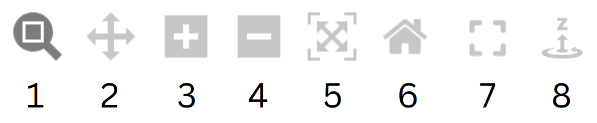

The tool displays interactive graphs used throughout the tasks. The data, content, and plot formats shown here are illustrative only and do not reflect the final tasks. The examples use the widely known machine learning dataset [Iris Species](https://www.kaggle.com/datasets/uciml/iris).

## Mouse controls

### Plot axes:
- left-click and drag
- right-click and drag
- mouse middle button and drag
- mouse scroll wheel 

### Toolbar:

1. Zoom select
2. Pan
3. Zoom in 
4. Zoom out
5. Autoscale to fit view
6. Reset to starting view
7. Fullscreen mode
8. Image rotation

